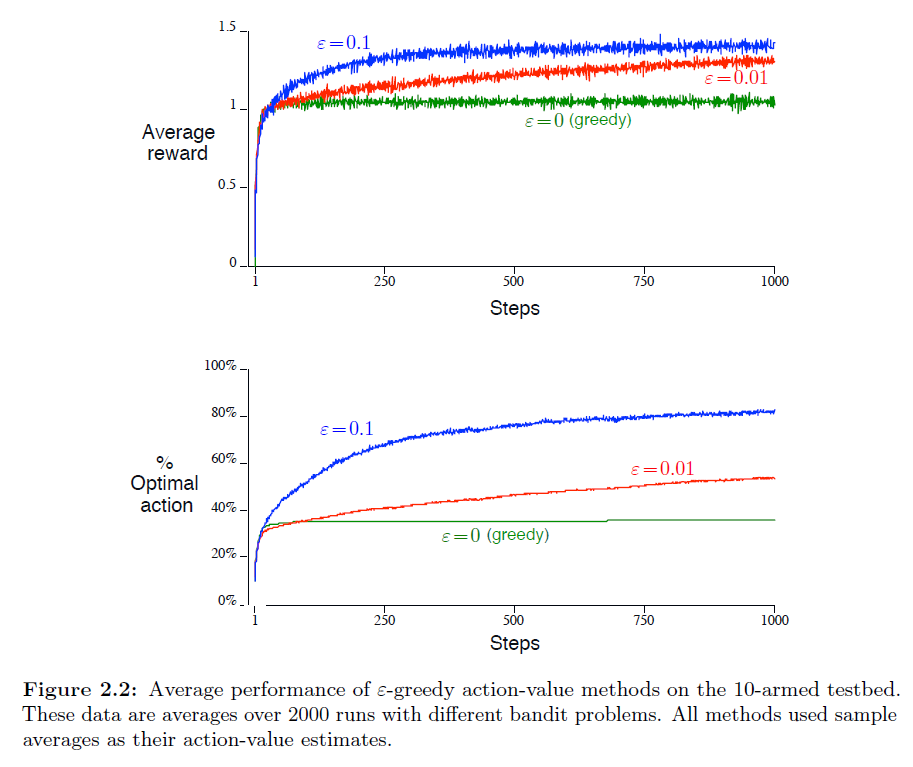

# 第二章 多臂赌博机 习题解答

## 练习2.1 $\varepsilon$-贪心算法

> 在$\varepsilon$-贪心动作选择中，对于两个动作且$\varepsilon=0.5$的情况，选择贪婪动作的概率是多少？

*解答：* $\varepsilon$表示采取随机动作的概率，$K$表示动作数（$K=2$）。
首先采取贪婪动作的概率为$1-\varepsilon=0.5$。其次因为$\varepsilon$的
概率从所有动作中随机挑选，也有$\frac{\varepsilon}{K}$的概率选中最优的
动作。所以采取贪婪动作的概率为$(1-\varepsilon)+\frac{\varepsilon}{K}=0.75$

## 练习2.2 赌博机问题案例

> 考虑有$k=4$个动作（表示为1、2、3和4）的$k$-臂赌博机问题。
> 对此问题应用$\varepsilon$-贪婪策略选择动作、应用样本均值来估计动作价值、用$Q_1(A)=0$作为初始估计值。
> 假设动作和奖励的初始序列为$A_1=1$，$R_1=-1$，$A_2=2$，$R_2=1$，$A_3=2$，$R_3=-2$，$A_4=2$，$R_4=2$，$A_5=3$，$R_5=0$。
> 在这段时间中的一些时间点上，$\varepsilon$情况可能已经发生，导致随机选择动作。这肯定发生在哪个时间点？这种情况可能发生在哪些时间点？

*解答：
时间序列$Q_t(a)$分析
Time 0: 0,0,0,0
Time 1: -1,0,0,0
Time 2: -1,1,0,0
Time 3: -1,-0.5,0,0
Time 4:-1,1/3,0,0
Time 5:-1,1/3,0,0

* $A_4$和$A_5$肯定是随机选择，而$A_1$、$A_2$和$A_3$可能是随机选择的。
因为在$t=4$时刻，$Q_4(A_2)=\frac{1+(-2)}{2}=-0.5<0=Q_4(A_4)$，,贪心策略下不可能在该时刻选择动作2，故此时是随机选择的动作2；
在$t=5$时刻，$Q_5(A_2)=\frac{1+(-2)+(2)}{3}=0.33>0$，且其他动作的估计价值都不大于0，贪心策略下必须选择动作2，故此时是随机选择的动作3。

## ~~练习2.3 选择最佳$\varepsilon$~~
> 在图2.2所示的比较中，就累计回报和选择最佳操作的概率$\varepsilon$而言，哪种方法在长期内表现最好？
> 会有多好呢？ 量化地表达你的答案。

*解答：* 先说结论，$\varepsilon=0.01$时，长期回报和选择最佳操作的概率都最高。
设操作种类为$K$，总共操作数为$M$，假设$M$足够大（即长期操作），累计回报$R_{sum}$和选择最佳操作的概率$p_{best}$可由如下公式得：
$$
\begin{align}
R_{sum}=M\times(Q_{best}(A) + \varepsilon\times(Q_{random}(A)-Q_{best}(A)))
\end{align}
$$

$$
\begin{align}
p_{best}=1-{\varepsilon}
\end{align}
$$

易知当$\varepsilon$减小，长期操作下的累计回报逐渐上升，且选择最佳操作的概率也提升。

## 练习2.4 
> 如果步长参数$\alpha_n$不是常数，则估计$Q_n$是先前收到的奖励的加权平均值，其权重不同于(2.6)所给出的权重。
> 就步长参数序列而言，一般情况下(类似于(2.6))每个先前奖励的权重是多少？

*解答：* 
$$
\begin{align}\notag
Q_{n+1} & = Q_n + \alpha(R_n-Q_n)\\ \notag
& = (1-\alpha_n)Q_n + \alpha_nR_n\\ \notag
& = (\prod_{i=1}^{n}(1-\alpha_i))Q_1 + \sum_{i=0}^{n-1}\alpha_{n-i}R_{n-i}\prod_{j=0}^{i-1}(1-\alpha_{n-j})\\ \notag
\end{align}
$$

## 练习2.5 编程练习
> 设计并进行一个实验来证明样本均值法对于非平衡问题的困难。使用10-臂赌博机问题的修改版本，
> 其中所有的q(a)一开始是相同的，然后进行独立的随机游走（例如，将均值为0且标准差为0.01的正态分布增量
> 添加到每一步上的所有q(a)。使用递增计算的样本均值来进行一个动作-价值方法，并使用恒定步长参数\alpha=0.1
> 的另一种动作-价值方法，并为他自准备如图2.2所示的曲线图。使用\varepsilon=0.1和更长的运行，比如100000步。

## 练习2.6 神秘的尖峰
> 神秘的尖峰 图2.3所示的结果应该非常可靠，因为它们是超过2000个随机选择的10臂赌博机任务的平均值。 那么，为什么乐观方法曲线的早期会出现振荡和峰值？换句话说，什么可能使这种方法在特定的早期步骤中表现得更好或更差？
>
> 

*解答：*
在第10步训练步数之后的某点，智能体将会找到最优的动作值。它将会贪心的选择这个值。小的步长参数意味着对最优值的估计将会很慢的收敛到真值。看起来这个真值小于5。这意味着因为小的步长，次优的动作仍然会有一个接近于5的价值。因此，在某些点，智能体开始不断的选择次优动作。
## 练习2.8 USB尖峰
> UCB算法在第11步显示出明显的性能峰值。为什么是这样？ 请注意，为了使您的答案完全令人满意，它必须解释为什么奖励在第11步增加以及为什么在随后的步骤中减少。 提示：如果 c=1，则尖峰不太突出。
> 
> *解答：*
> 在前$k$个步骤中，$A_t = argmax_a[Q_t(a) + c\sqrt{\frac{lnt}{N_t(a)}}]$，未被选择的动作中，$N_t(a)\to\infty$，则未被选择的动作优先选择，在$A_{10}$为贪婪动作，则此时UCB优于$\epsilon$，$Q_{10}(a_{10}) + c\sqrt{\frac{ln10}{2}}$变小，则Q值较小的动作优先被选择，导致奖励下降，当$c=1$时，$c\sqrt{\frac{lnt}{N_t(a)}}$影响较小，所以尖峰不太突出。
>
> 当$t\to\infty$时，$\sqrt{\frac{lnt}{N_t(a)}}\to1$，转变为绝对贪婪选择。
>
> 

